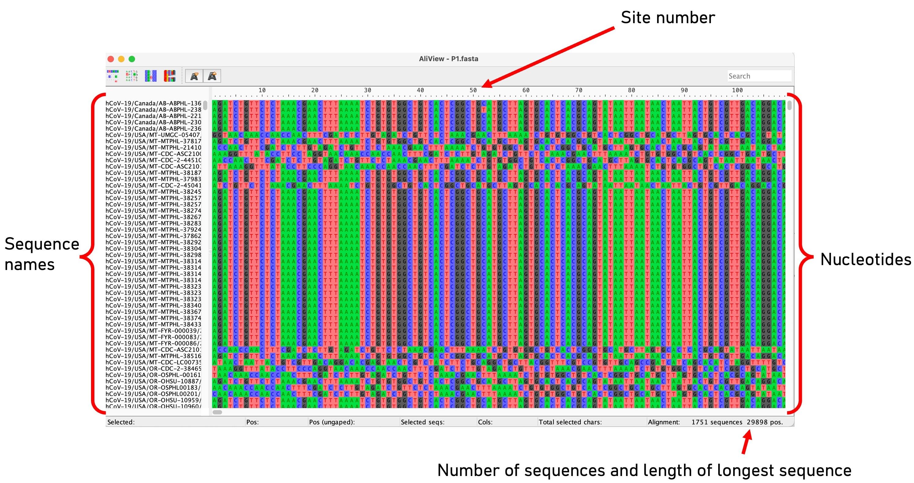

# Align consensus sequences

In the previous exercise, we constructed a FASTA file of aligned sequences comprised of SNPs that was built using a VCF from sequences that had all been aligned to the same reference strain. In some cases though, you may receive different consensus sequences from different sources that are not already aligned. This may be because they have been mapped against different reference strains or assembled using a reference-free approach (e.g., _de novo_ assembly). This will be the case when downloading SARS-CoV-2 sequences from GISAID (Practical 1, exercise 1).

To compare sequences and identify variation to allow for phylogenetic tree building and genomic comparison, sequences must be aligned so that the position of corresponding sites matches. Here, we will use the program "mafft" to align 1788 SARS-CoV-2 P.1 variant sequences that have been collected from North America and assembled in different groups. We will align the sequences against the well-characterized Wuhan-1 SARS-CoV-2 sequence (GenBank accession number MN908947.3), which is 29903 bp in length and has been been used previously as a reference strain.

The data we will use for this exercise are:

- **P1.fasta** - A FASTA file containing the unaligned 1788 SARS-CoV-2 P.1 sequences downloaded from GISAID.

- **Wuhan1.fasta** - The Wuhan-1 SARS-CoV-2 strain.

<br>

1. View the unaligned "P1.fasta" file in AliView. It should look like this:

    

2. Input the following command to align the sequences to the Wuhan-1 reference strain:

```bash
mafft --auto --thread -2 --keeplength --preservecase --addfragments P1.fasta Wuhan1.fasta > P1_aligned.fasta
```

_This may take a few minutes to execute._

| Option           | Description                                                                                                           |
|-------------------|-----------------------------------------------------------------------------------------------------------------------|
| `auto`            | Automatically selects an appropriate strategy from L-INS-i, FFT-NS-i, and FFT-NS-2, according to data size.             |
| `thread`          | The number of threads to use for multi-threading. Here we have used 2 threads, but you can use more to increase speed. |
| `keeplength`      | Aligns the sequences while preserving the length of the reference strain. This is optimal to allow for better indexing of sites against the well-characterized reference sequence.                                                                                                    |
| `preservecase`    | Retains all nucleotides as lower/uppercase.                                                                                                                 |
| `addfragments`    | Will add fragments of sequences to existing alignments (good for closely related samples.                                                                                                                |
| `P1.fasta`        | The name of our unaligned input file.                                                                                 |
| `Wuhan1.fasta`    | The name of our reference sequence.                                                                                   |
| `P1_aligned.fasta`| The name of our output file.                                                                                          |


This will align your sequences to the Wuhan 1 reference strain, and add the reference strain into the alignment (the name will be the GenBank accession number MN908947.3).

3. View your newly aligned sequence using AliView.


### Exercise:

The recommendation for SARS-CoV-2 sequence alignments to the Wuhan 1 reference is to mask sites at the start and end of the sequence as these are prone to errors in sequencing, which results in a high number of ambiguities. The positions to mask are all nucleotides from 1 - 264 and 29674 - 29903.

The solution is to cut the sequence at these positions or to replace all nucleotides at these positions with an ambiguous base call "N". The latter is the best option as we keep the sequence length as 29903, this will allow us to retain the positions relative to Wuhan 1 that . It will also retain the position to easily interpret any estimates for the substitution or mutation rate in any subsequent analysis (we will cover this in future practicals).

4. Open R

5. Make sure the program 'seqinr' is installed:

```R
install.packages("seqinr")
library(seqinr)
```

6. Read in the aligned sequence file "P1_aligned.fasta". This will assign the sequence alignment as a list in R.

```R
P1_aligned<-seqinr::read.fasta("P1_aligned.fasta", forceDNAtolower = F)
```

7. Try to write a short script in R that will change the nucleotides at the masked positions and call this new list "P1_aligned_masked"

8. Save the new masked fasta file with the following command:

```R
seqinr::write.fasta(P1_aligned_masked,names(P1_aligned_masked),"P1_aligned_masked.fasta",open = "w")
```  

_Tips:_ <br>
_1. Each samples sequence is list element, so you can use the 'lapply' function to apply to all sequences_ <br>
_2. Use the 'replace' function_ <br>
_3. The names of each list element will not be carried out after replacing so add the names of "P1_aligned" to "P1_aligned_masked"_ <br>

Please work together if needed and if you get stuck, there is a solution [here](mask_sites.md).


9. Finally, view your aligned and masked sequence file by opening with AliView.


Next activity: [Maximum Likelihood phylogenetic trees](ML_trees.md)

