# Obtaining sequence data

While you will be provided with all the data you need for this course, normally you would either receive data directly from the sequencer/sequencing facility, from collaborators that hold the data (perhaps through a secure link), or download data from a number of publicly accessible databases.

For the first activity, we will introduce three of these databases and take you through how to search for and download sequences. The location and format of the sequence data will depend on the taxa of interest and whether you require the raw sequence data or partially or fully assembled sequences. 

### [European Nucleotide Archive (ENA)](https://www.ebi.ac.uk/ena/browser/search)

This online database is a good resource for obtaining raw sequencing data but it also contains sequence assemblies and functional annotation. 

Often, newly sequenced genomic data that is being reported in a publication will be submitted to ENA and you can find the corresponding project ID number in the paper (often in a "Data availability" section). There will be a number like "Project ID ERP000436".

1. Click the link to ENA above.

2. You will be sent to a search page (below). Type "ERP000436" into the search bar.

    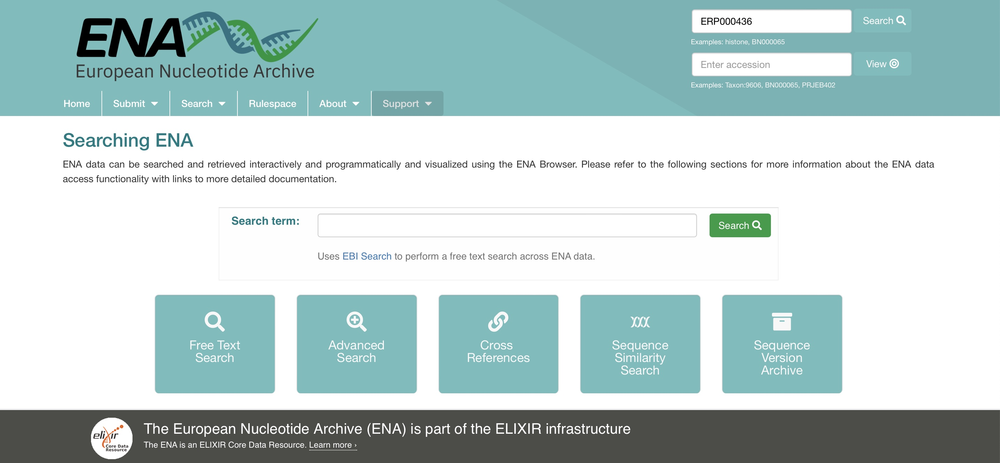

<br>

3. This will bring up the following page with all results from that ID. Click on the number under the "Study" section.

    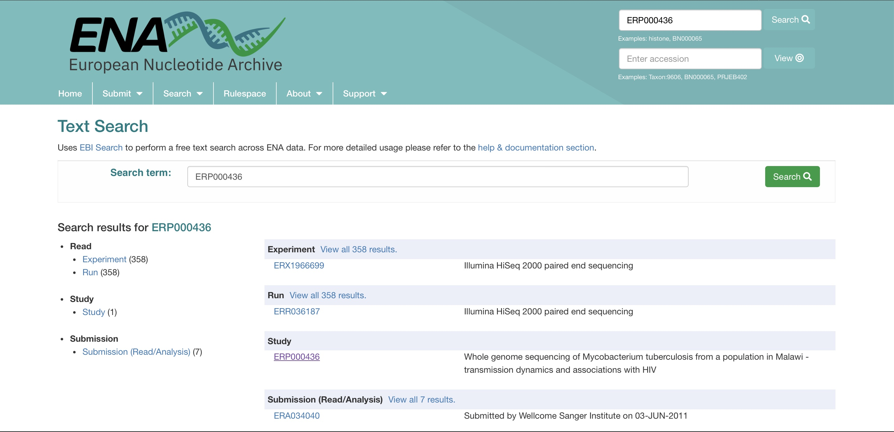
 
<br>

4. The project details will be shown as follows:

    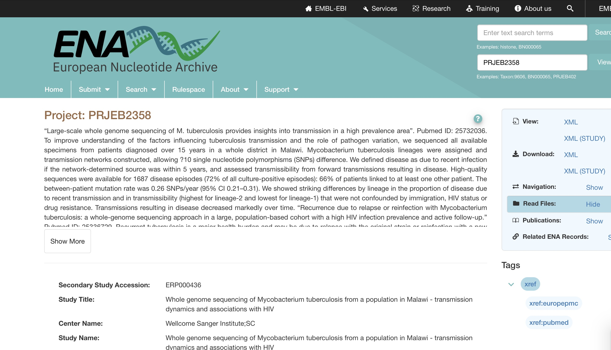

<br>

5. Scroll down and you will find the individual samples stored as part of the study. In this project there are 386 _M. tuberculosis_ samples.

    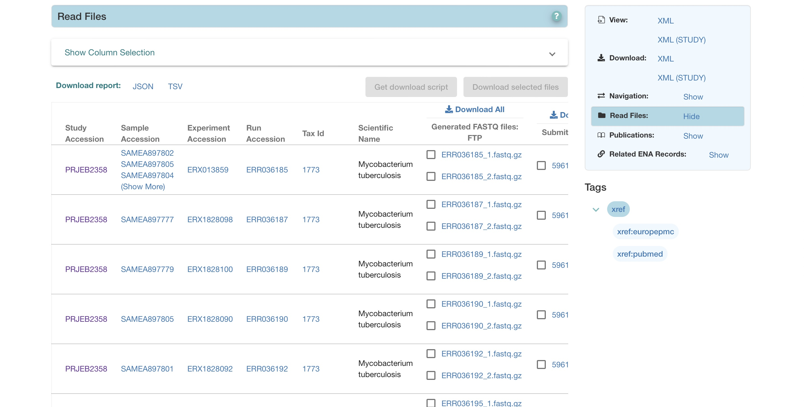

<br>

6. Scroll to the right, you will see the options for download. In this study, both paired-end raw sequencing (FASTQ) files are available and an aligned genome file per sample. More on these formats later. These files are available to download through FTP, but some data are available through SRA (Sequence Read Archive) format, a specialized format for NGS data. This is where you can click on a file and download it.

    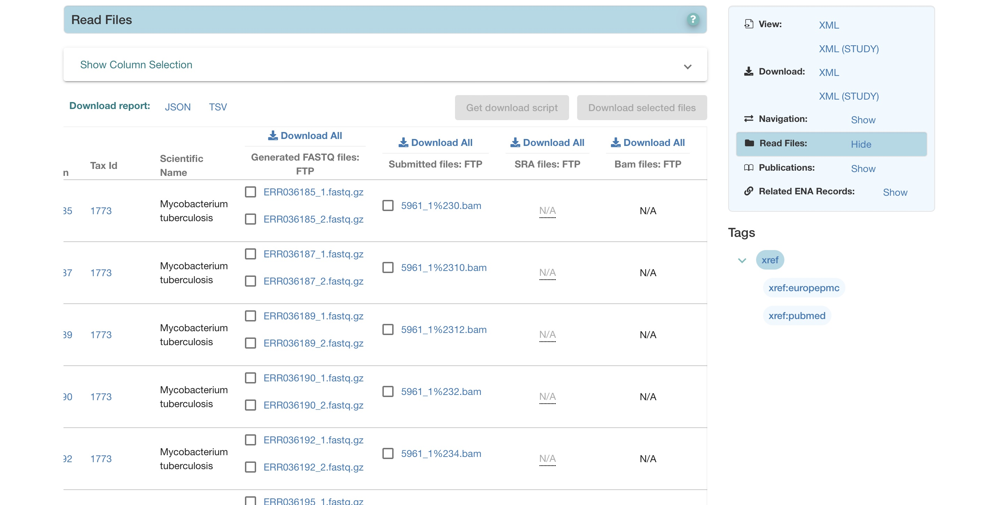

<br>

You can also batch download files from ENA using FTP through the command line with the program [wget](https://www.gnu.org/software/wget/manual/wget.html). This can be more efficient when downloading large amounts of data. You will need to know the name and path to the files you want to download. These can be found in the report file for each project, found here:

   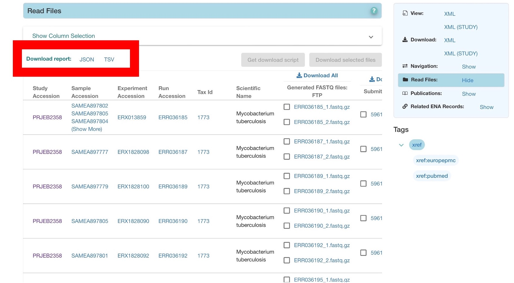

<br>

This command will just download the two paired-end FASTQ files shown from project ERP000436, but you can develop more complex command line scripts to iterate through many file names in parallel.

```bash
wget -nc ftp://ftp.sra.ebi.ac.uk/vol1/fastq/ERR036/ERR036185/ERR036185_1.fastq.gz
wget -nc ftp://ftp.sra.ebi.ac.uk/vol1/fastq/ERR036/ERR036185/ERR036185_2.fastq.gz
```


<br>

### [National Center for Biotechnology Information (NCBI)](https://www.ncbi.nlm.nih.gov)

NCBI provides access to a wide range of databases and tools, including the GenBank nucleotide database. This is a great resource for accessing curated and well-characterized reference strains, providing a standardized basis for comparison and analysis across experiments. Most commonly used reference sequences will be referenced in publications with a GenBank accession number (e.g., NC_000962.3 for the _Mycobacterium tuberculosis_ H37Rv reference strain.

1. Click the link to NCBI above.

2. You will be sent to a page (below): 

    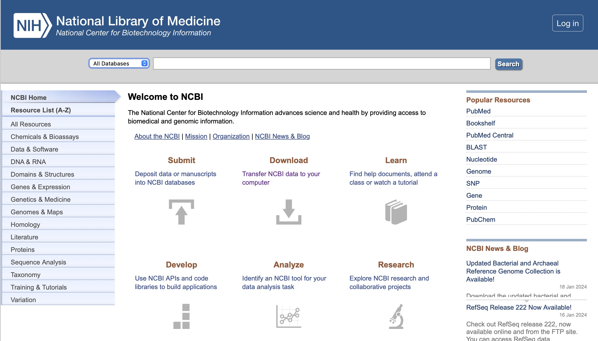

<br>

3. Type "NC_000962_3" into the search bar. This is the accession number of H37Rv.

    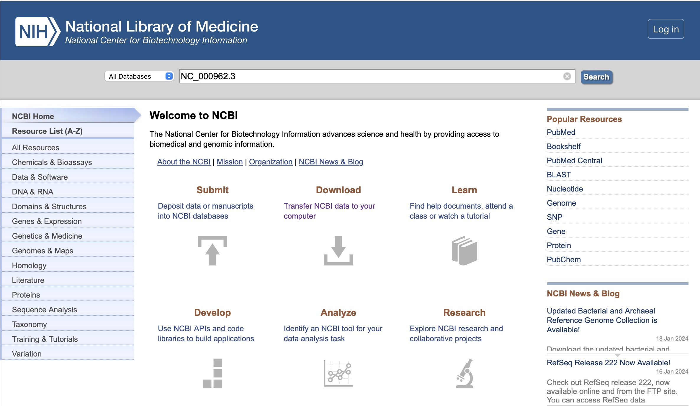

<br>

4. This will bring up the following result, click on the name 'Mycobacterium tuberculosis H37Rv, complete genome':

    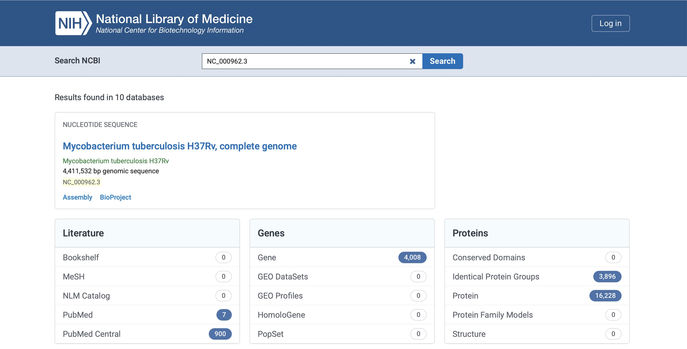

<br>

5. You will be directed to the result page for that genome:

    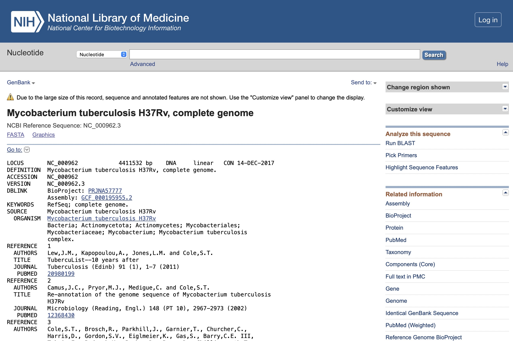

<br>

6. To download the complete genome in a FASTA format file (a simple text-based format for representing nucleotide sequences), click "send to", choose "Complete record", "Choose Destination - File", and "FASTA" in the "format" dropdown menu. Then click "Create File"

    

This will download the full sequence.

<br>

<br>

### [Global Initiative on Sharing All Influenza Data (GISAID)](https://gisaid.org)

The Global Initiative on Sharing All Influenza Data (GISAID) facilitates the open sharing of genetic and clinical data related to influenza and other emerging viruses. Recently, ithas played a pivotal role in the global response to the COVID-19 pandemic by serving as a key platform for sharing genomic data related to SARS-CoV-2.

_Note: _

1. Click the link to GISAID above. You will be directed to the following page:
   
    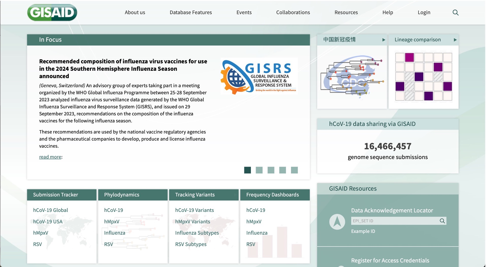

<br>

2. Login by clicking "login" in the top right, you will be directed here:
   
    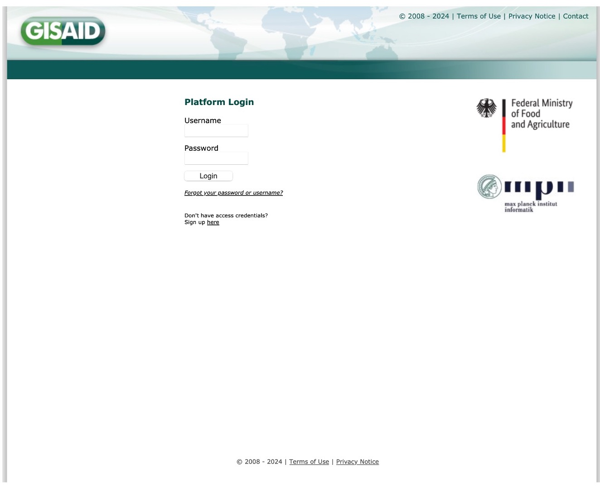

<br>

3. After logging in, you will reach this page. As you can see, there are multiple databases in GISAID. Here, we will look at downloading SARS-CoV-2 assembled genomes. These sequence files are found in the "EpiCoV" section, and sequences can be found through the "Search" option:
   
    

<br>

4. You will be directed here. As you can see there are over 16 million sequences that have been submitted:
   
    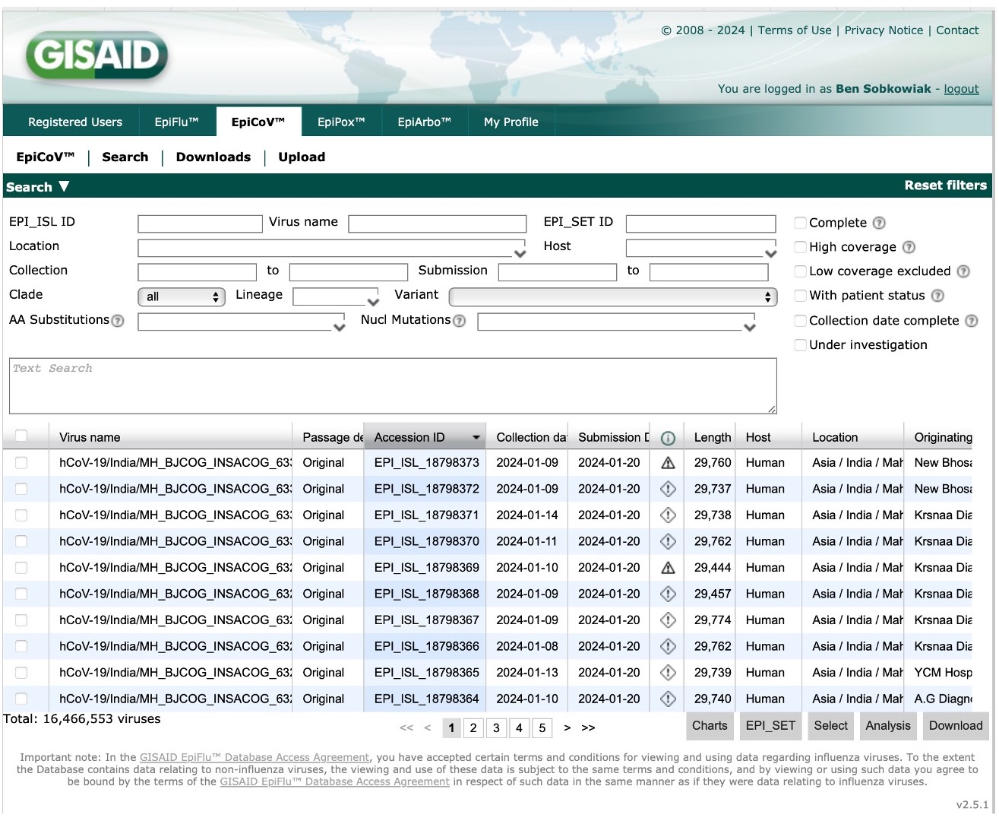

<br>

5. We can choose which sequences to download using the options in the boxes on the page, including filtering by location and lineage. Let's type "Canada" into the "Location" box:
   
    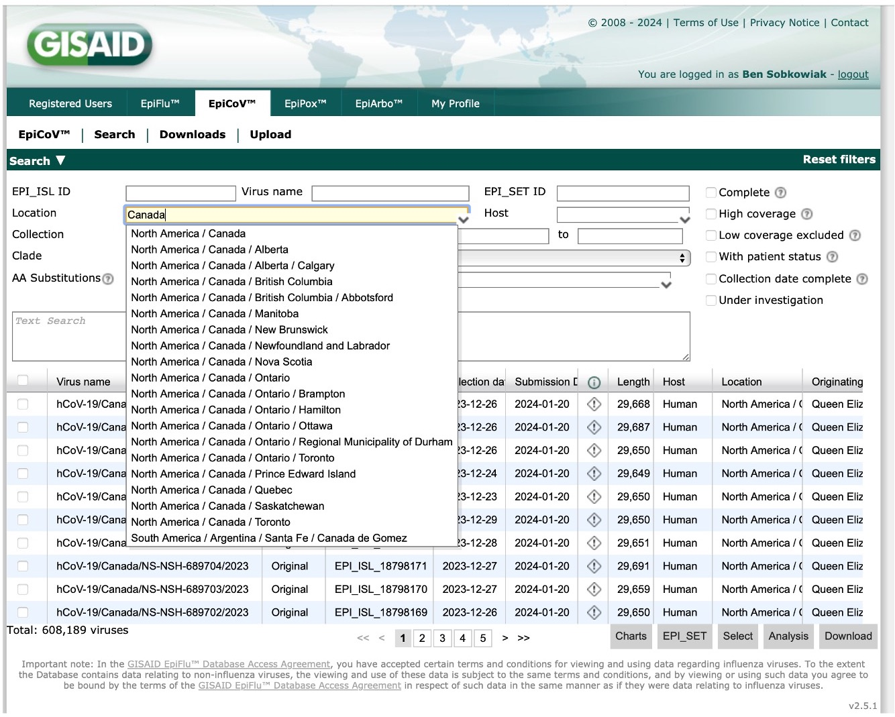

<br>

6. There are over 608,000 SARS-CoV-2 sequences from Canada that have been deposited. We can further filter the data by variant. Lets type "P.1" into the "Lineage" box:
   
    

<br>

7. This takes us to around 400 SARS-CoV-2 P.1 sequences from Canada that have been deposited on GISAID. We can also filter to only include complete, high coverage geomes with a complete collection date by selecting the boxes on the right:
   
    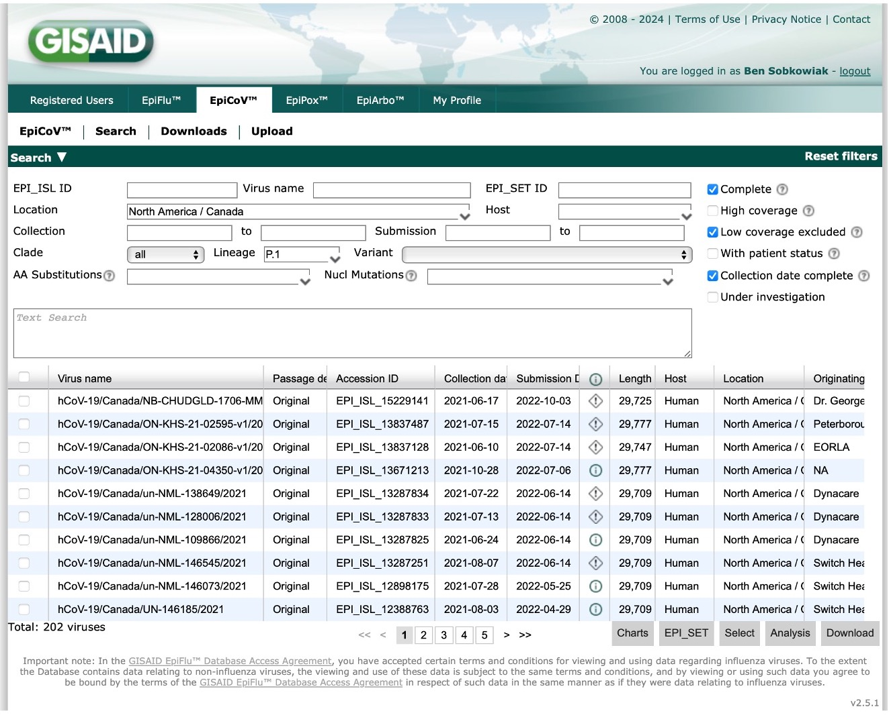

<br>


8. Now we have 202 sequences. Let's download these by selecting all by ticking the box highlighted in red, and clicking "Download" at the bottom right:
   
    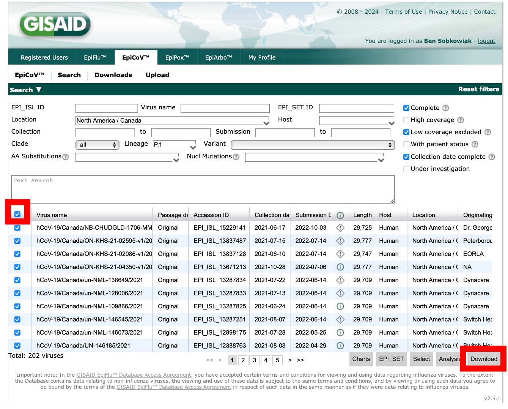

<br>

9. This will now give you the option of which data to download. For the sequence data select "Nucleotide Sequences (FASTA)". Another important dataset is the "Patient status metadata", which will download all metadata associated with the sequences such as collection dates.
   
    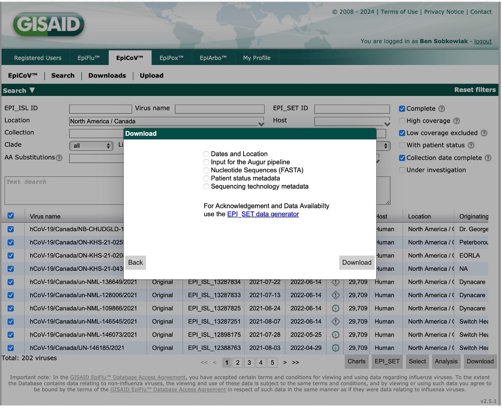

<br>

_Note, GISAID will only allow downloads of ~5,000 sequences at the same time, and you must have a login to access the database. Any sequence data obtained from GISAID must be reference appropriately, as detailed [here](https://gisaid.org/publish/)._

<br>

Next acitvity: [Viewing raw sequence data (FASTQ) files](View_raw_sequence.md)
