# Obtaining sequence data

While you will be provided with all the data you need for this course, normally you would either receive data directly from the sequencer/sequencing facility, from collaborators that hold the data (perhaps through a secure link), or download data from a number of publicly accessible databases.

For the first activity, we will introduce three of these databases and take you through how to search for and download sequences. The location and format of the sequence data will depend on the taxa of interest and whether you require the raw sequence data or partially or fully assembled sequences. 

### [National Center for Biotechnology Information (NCBI)](https://www.ncbi.nlm.nih.gov)

NCBI provides access to a wide range of databases and tools, including the GenBank nucleotide database and SRA, the Sequence Read Archive. Genbank is great resource for accessing curated and well-characterized reference strains, providing a standardized basis for comparison and analysis across experiments, along with providing links to raw sequence data found in ENA. Most commonly used reference sequences will be referenced in publications with a GenBank accession number (e.g., NC_000962.3 for the _Mycobacterium tuberculosis_ H37Rv reference strain.

Here we will go through how to download a complete assembly in the FASTA format, such as a reference strain:

#### NCBI Genbank - downloading complete assemblies

1. Click the link to NCBI above.

2. You will be sent to a page (below): 

    

<br>

3. Type "NC_000962_3" into the search bar. This is the accession number of H37Rv.

    

<br>

4. This will bring up the following result, click on the name 'Mycobacterium tuberculosis H37Rv, complete genome':

    

<br>

5. You will be directed to the result page for that genome:

    

<br>

6. To download the complete genome in a FASTA format file (a simple text-based format for representing nucleotide sequences), click "send to", choose "Complete record", "Choose Destination - File", and "FASTA" in the "format" dropdown menu. Then click "Create File"

    

This will download the full sequence in the FASTA format.


#### NCBI SRA - downloading raw sequencing data

Newly sequenced genomic data that is being reported in a publication will be submitted to SRA (or ENA below) and you can find the corresponding project ID number in the paper (often in a "Data availability" section). There will be a number like "Project ID ERP000436". You can download directly from the website, or use the SRA-toolkit to download many sequences. A good tutorial for using the SRA-toolkit is found [here]((https://github.com/ncbi/sra-tools/wiki/01.-Downloading-SRA-Toolkit).

Here we will download raw sequencing data directly from NCBI SRA:

1. Navigate back to the [NCBI homepage](https://www.ncbi.nlm.nih.gov). 

2. Select "SRA" from the dropdown box.

    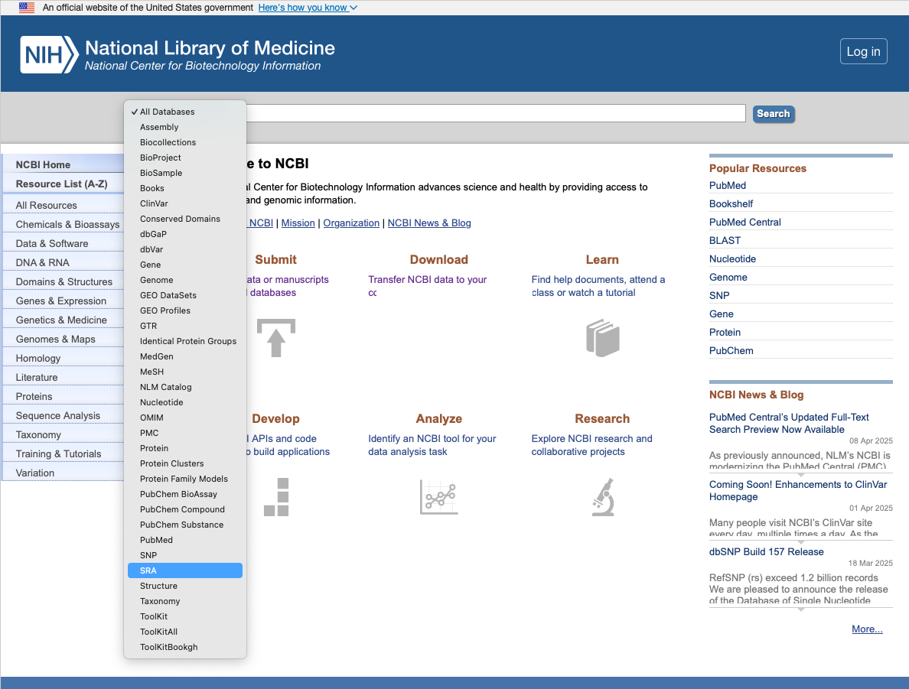


3. Type in the project ID (you can also search for specific sequence accessions or even a general search term such as _Mycobacterium tuberculosis_). Here we will search for the project ID ERP000436.

    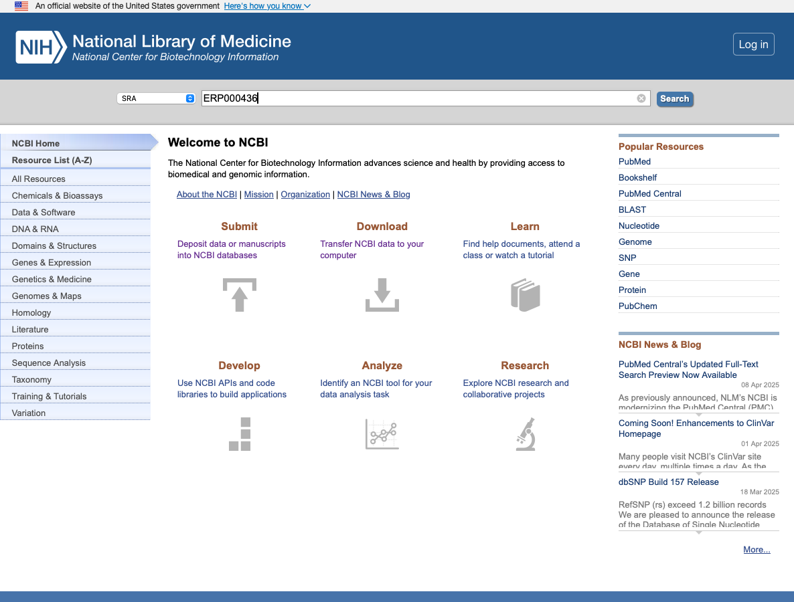


4. This will pull up all the sequences associated with this project ID. You can search through these individually to look at the data associated with each sequence. To download the sequencing data we will select the "send results to Run selector" button. 

    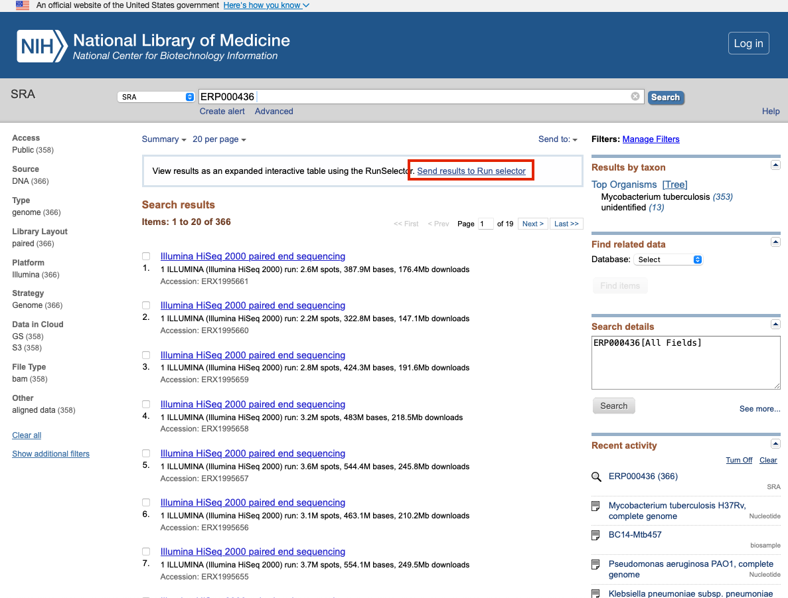


5. This will send you to the 'SRA Run Selector' page, which contains information about the project and the sequences contained within. Here we can see we have 358 runs (samples) that totals 208.58GB of data.

    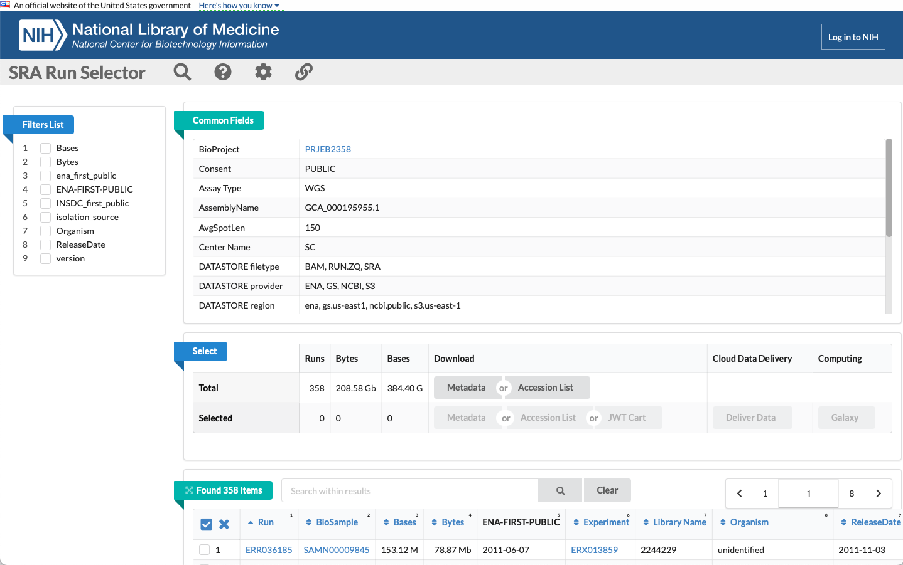

6. If you scroll down you will see each sample with the run accession number and all other associated metadata. We can select the first one in this list:

    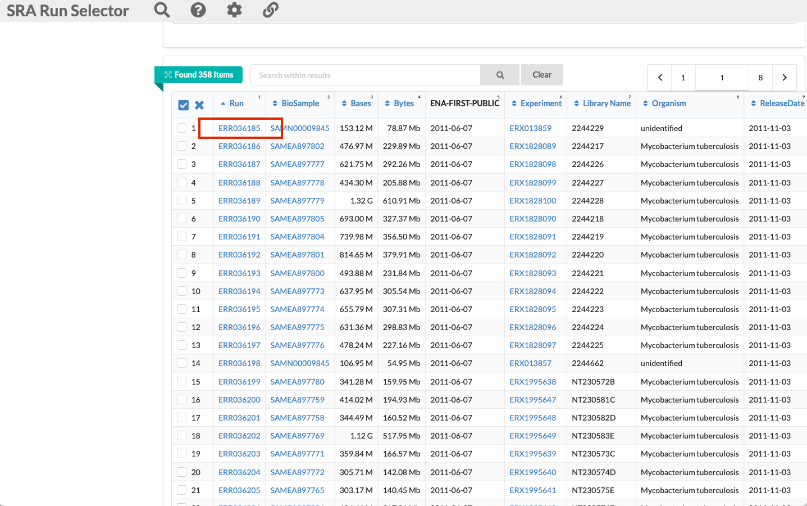

7. This will take us to the sample page. If we click the "FASTA/FASTQ Download" button, this is where we can obtain the sequence data files:

    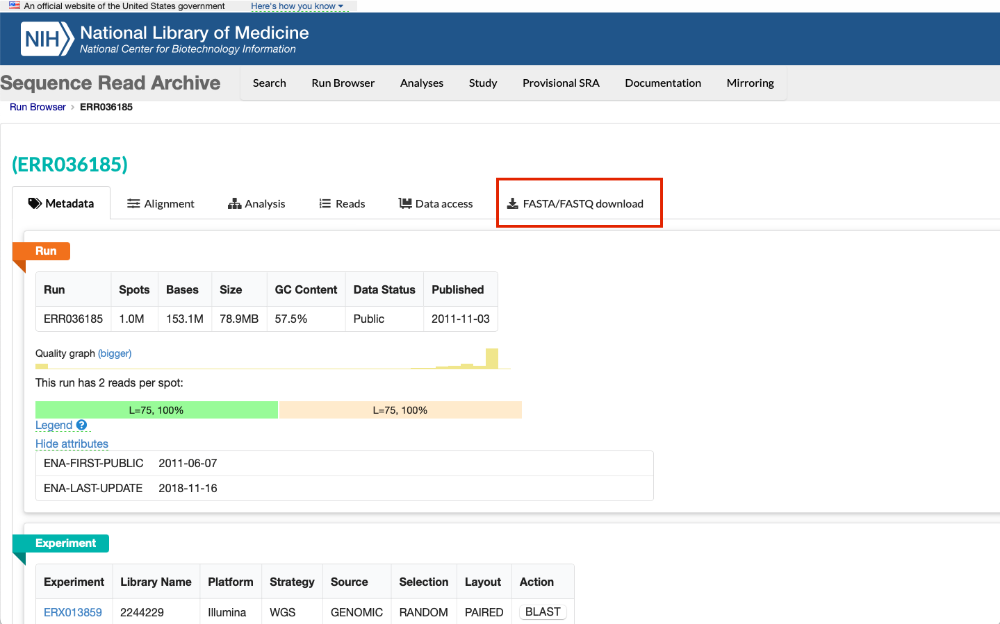

8. We want the raw sequence data for this sample in the FASTQ format, so we can select the "FASTQ" button. This will automatically start a download of the data.
9. 
     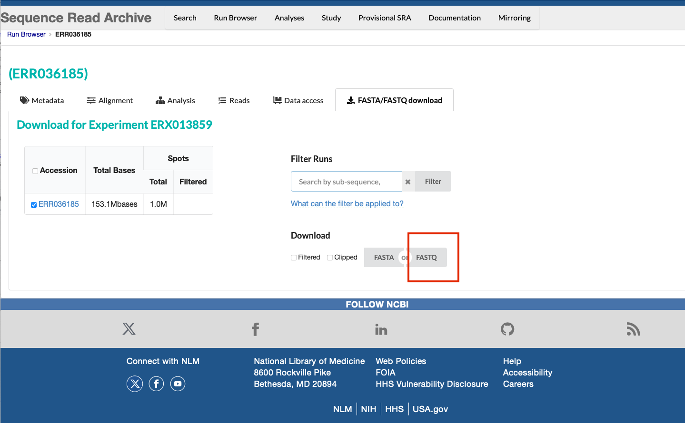

It is important to note that downloading the data from SRA will result in a single FASTQ file, even if the data are paired data that should be separated into 2 files (forward and reverse reads). To obtain the split FASTQ files, you will need to use the SRA-toolkit as descibed above, or download the data from ENA, as per the following exercise.


<br>

### [European Nucleotide Archive (ENA)](https://www.ebi.ac.uk/ena/browser/search)

This online database is another good resource for obtaining raw sequencing data but it also contains sequence assemblies and functional annotation. Sequences submitted to SRA will also be (and vice versa). Downloading data directly from ENA can be faster than SRA and 

Here we will search for sequences in Project ID ERP000436 in ENA:

1. Click the link to ENA above.

2. You will be sent to a search page (below). Type "ERP000436" into the search bar.

    

<br>

3. This will bring up the following page with all results from that ID. Click on the number under the "Study" section.

    
 
<br>

4. The project details will be shown as follows:

    

<br>

5. Scroll down and you will find the individual samples stored as part of the study. In this project there are 386 _M. tuberculosis_ samples.

    

<br>

6. Scroll to the right, you will see the options for download. In this study, both paired-end raw sequencing (FASTQ) files are available and an aligned genome file per sample. More on these formats later. These files are available to download through FTP, but some data are available through SRA (Sequence Read Archive) format, a specialized format for NGS data. This is where you can click on a file and download it.

    

<br>

You can also batch download files from ENA using FTP through the command line with the program [wget](https://www.gnu.org/software/wget/manual/wget.html). This can be more efficient when downloading large amounts of data. You will need to know the name and path to the files you want to download. These can be found in the report file for each project, found here:

   

<br>

This command will just download the two paired-end FASTQ files shown from project ERP000436, but you can develop more complex command line scripts to iterate through many file names in parallel.

```bash
wget -nc ftp://ftp.sra.ebi.ac.uk/vol1/fastq/ERR036/ERR036185/ERR036185_1.fastq.gz
wget -nc ftp://ftp.sra.ebi.ac.uk/vol1/fastq/ERR036/ERR036185/ERR036185_2.fastq.gz
```
<br>


### [Global Initiative on Sharing All Influenza Data (GISAID)](https://gisaid.org)

The Global Initiative on Sharing All Influenza Data (GISAID) facilitates the open sharing of genetic and clinical data related to influenza and other emerging viruses. Recently, ithas played a pivotal role in the global response to the COVID-19 pandemic by serving as a key platform for sharing genomic data related to SARS-CoV-2.

1. Click the link to GISAID above. You will be directed to the following page:
   
    

<br>

2. Login by clicking "login" in the top right, you will be directed here:
   
    

<br>

3. After logging in, you will reach this page. As you can see, there are multiple databases in GISAID. Here, we will look at downloading SARS-CoV-2 assembled genomes. These sequence files are found in the "EpiCoV" section, and sequences can be found through the "Search" option:
   
    

<br>

4. You will be directed here. As you can see there are over 17 million sequences that have been submitted:
   
    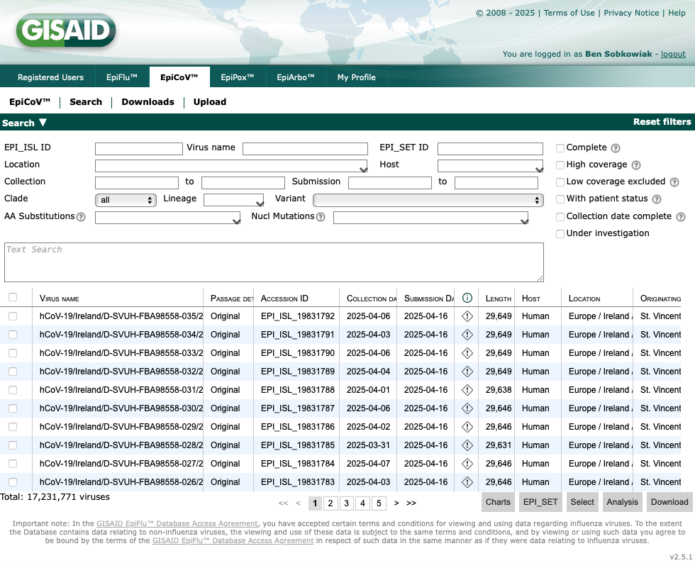

<br>

5. We can choose which sequences to download using the options in the boxes on the page, including filtering by location and lineage. Let's type "Taiwan" into the "Location" box:
   
    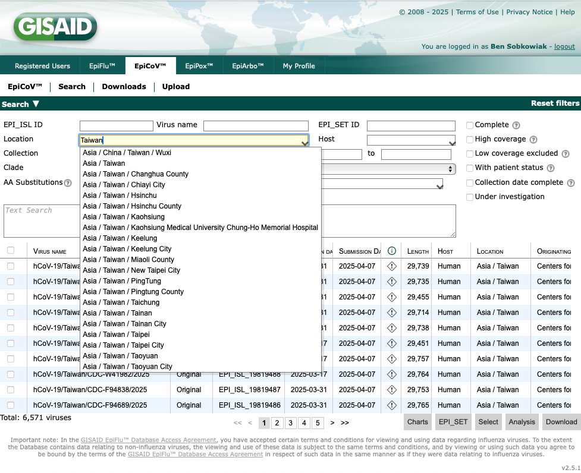

<br>

6. There are over 6,000 SARS-CoV-2 sequences from Taiwan that have been deposited. We can further filter the data by variant. Lets type "B.1.1.7" into the "Lineage" box:
   
    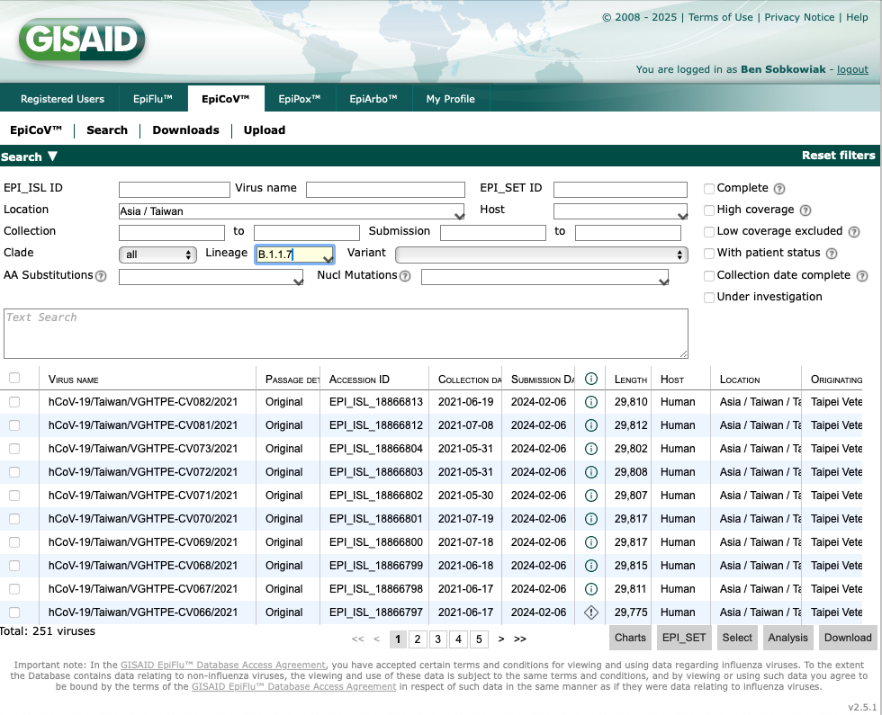

<br>

7. This takes us to 251 SARS-CoV-2 B.1.1.7 sequences from Taiwan that have been deposited on GISAID. We can also filter to only include complete, high coverage geomes with a complete collection date by selecting the boxes on the right:
   
    

<br>


8. Now we have 246 sequences. Let's download these by selecting all by ticking the box above the sequences on the left, and clicking "Download" at the bottom right:
   
    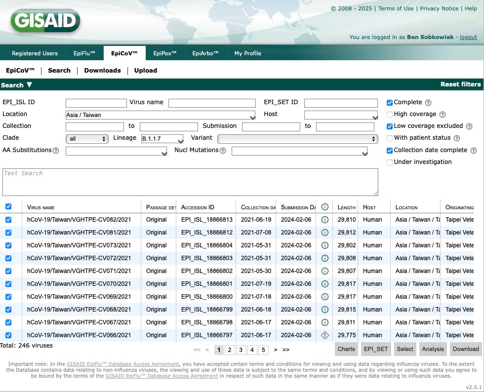

<br>

9. This will now give you the option of which data to download. For the sequence data select "Nucleotide Sequences (FASTA)". Another important dataset is the "Patient status metadata", which will download all metadata associated with the sequences such as collection dates.
   
    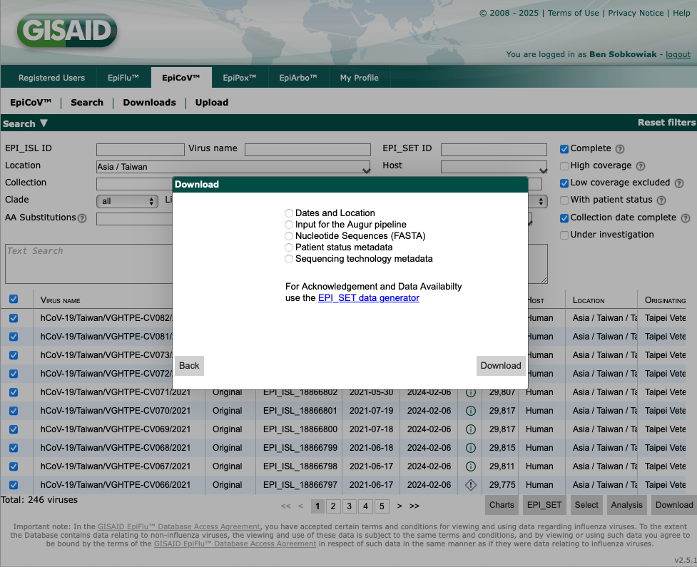

<br>

_Note, GISAID will only allow downloads of ~5,000 sequences at the same time, and you must have a login to access the database. Any sequence data obtained from GISAID must be reference appropriately, as detailed [here](https://gisaid.org/publish/)._

<br>

Next acitvity: [Viewing raw sequence data (FASTQ) files](View_raw_sequence.md)
