# Quality control (QC) of FASTQ files

As you can see from the previous activity, viewing and checking FASTQ files in this format is not very useful or efficient. 

We can instead use a program called FASTQC to view FASTQ files in a more user-friendly way that allows us to see summary statistics for the sequence data. From this visualization, we can check for any potential issues with these data that may need resolving.

We will be looking at sequence data from four different samples (named Test 1-4) from your dataset to illustrate different potential issues. 

These sample data are as follows:

- **Test1.fastq.gz** – Single-end 50bp sequence data from _Mycobacterium tuberculosis_, collected from sputum and cultured before DNA library preparation. 

- **Test2.fastq.gz** – Single-end 125bp sequence data from _Shigella flexneri_, collected from sputum and cultured before DNA library preparation.

- **Test3_R1.fastq.gz** and **Test3_R2.fastq.gz** – Paired-end 250bp sequence data from _Mycobacterium tuberculosis_, collected from sputum and cultured before DNA library preparation.

- **Test4_R1.fastq** and **Test4_R2.fastq** – Paired-end 150bp sequence data from _Mycobacterium smegmatis_ that has been transformed using a plasmid vector.

 

#### 1. Open file “Test1.fastq.gz” in FASTQ by double-clicking the FASTQC icon and selecting “File>Open…” and finding the FASTQ file in the folder in which your data is stored.

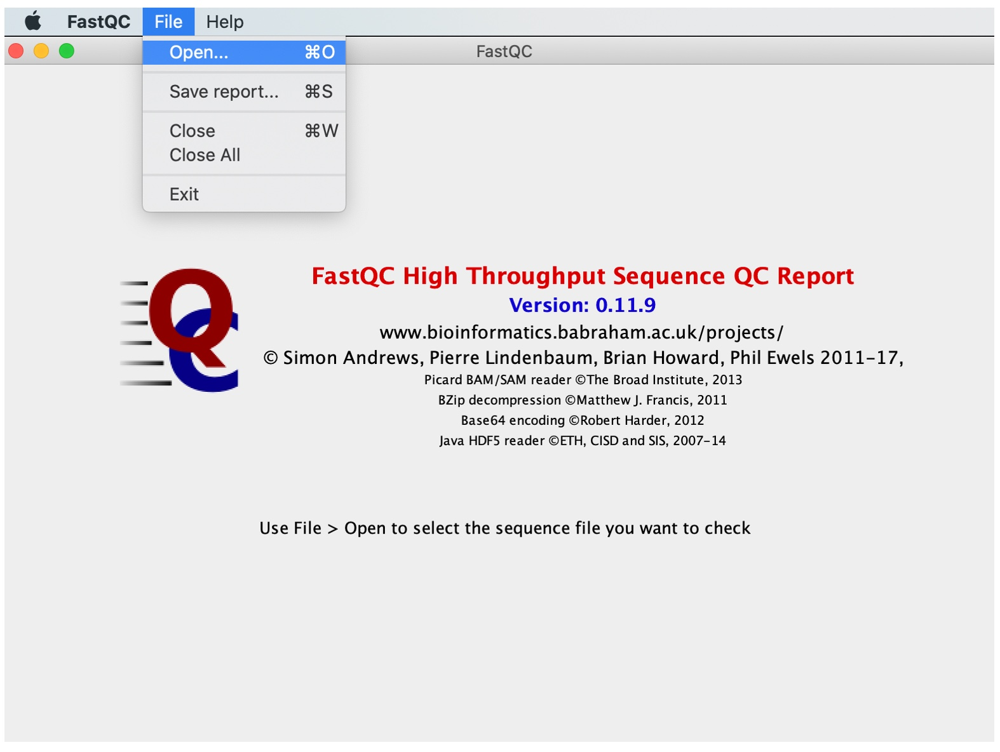

FastQC performs several analyses, described in modules on left hand side of the main window:
   
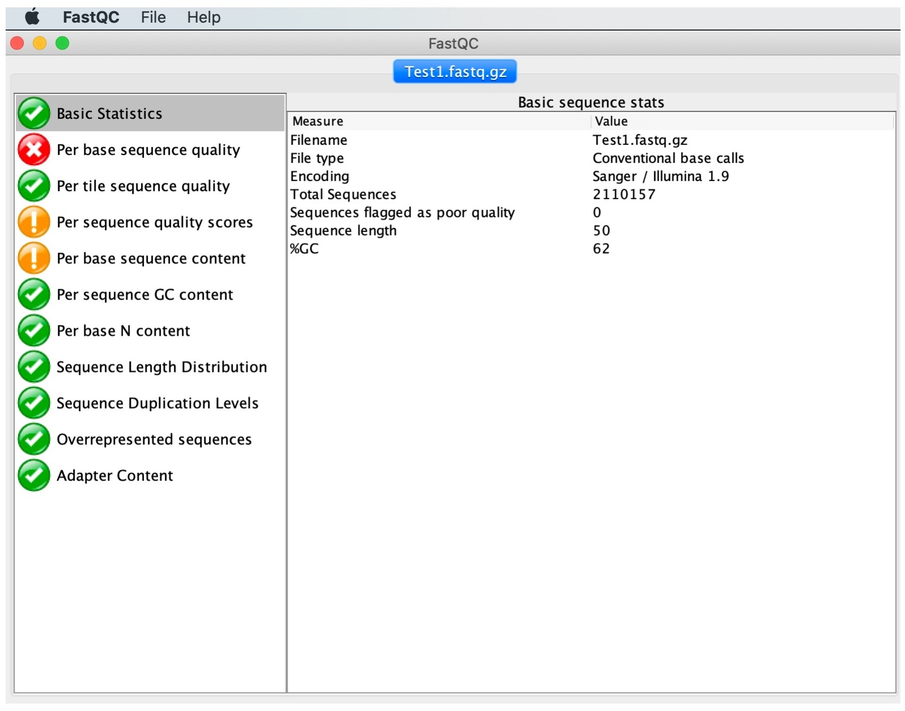

Normal results are marked with green ticks, slightly abnormal with orange exclamation marks and very unusual with red crosses. 
Note that these results should be taken as guidance in the context of our samples and never as pass/fail results. Nevertheless, they will highlight major problematic aspects. Let us now interpret the output of some of the most important modules.

 

#### 2. Click on 'Basic Statistics'

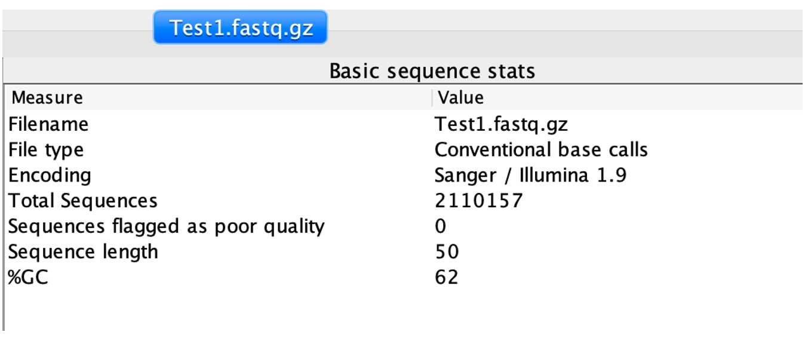

This module provides overall information including the total number of reads, read length and %GC content.

 

#### 3. Click on 'Per base sequence quality'

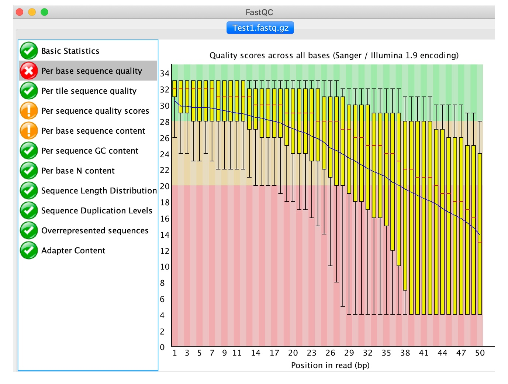

This view shows the quality values (y-axis) along the read at each nucleotide position (x-axis). The greater this value, the lower the probability that the corresponding base call is incorrect. At each position a Box plot is drawn where the central read line is the median; the yellow box represents the inter-quartile range (25-75%); the upper and lower whiskers the 10% and 90% points; and the blue line correspond to the mean quality.

As is the case with our sample, call quality degrades towards the 3’ end of the read. This is often the case as in almost every sequencing technology, chemistry deteriorates towards the ends of the sequences and, consequently, the quality values declines in a corresponding manner. Reads can be trimmed or clipped to reduce the number of potential sequencing errors and increase the likelihood that a read can be aligned (Next activity).

 

#### 4. Click on 'Per tile sequence quality'

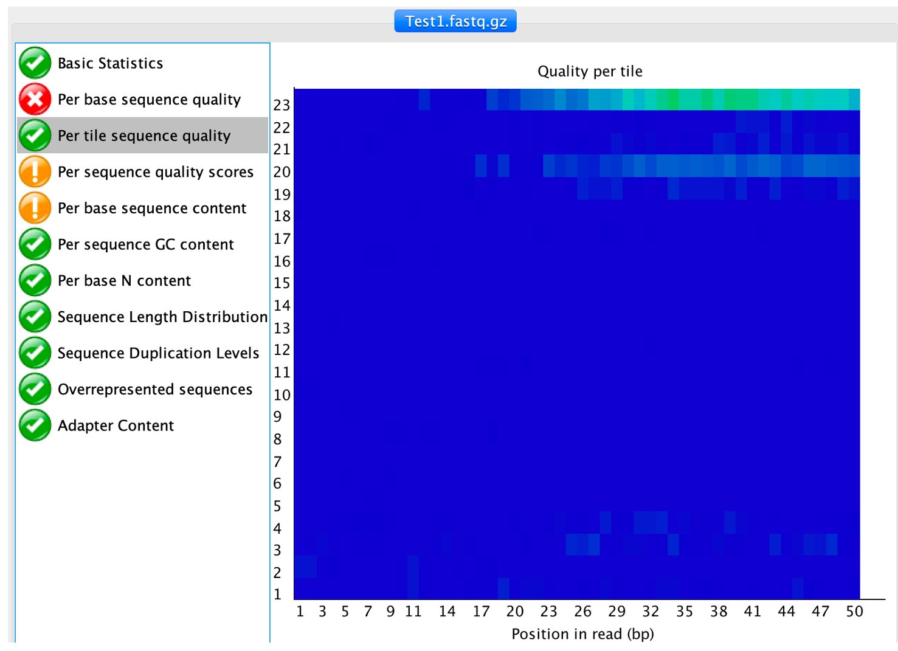

Flow cells on the sequencer are divided into tiles, this analysis compute the sequence quality per tile to determine if there are any loss of sequence quality associated with any particular flow cell. 

 

#### 5. Click on 'Per sequence quality scores'

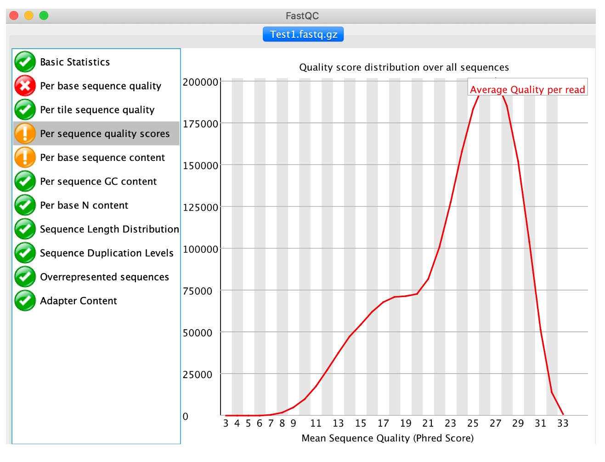

This analysis computes the mean quality of each read and then displays for all observed values the number of reads having such quality. It is expected that a small subset will have universally poor quality. FastQC outputs a warning if the most frequently observed mean is below 27 (corresponding to a 0.2% error rate) and a failure if is below 20 (1% error rate).

 

#### 6. Click on 'Per base sequence content'

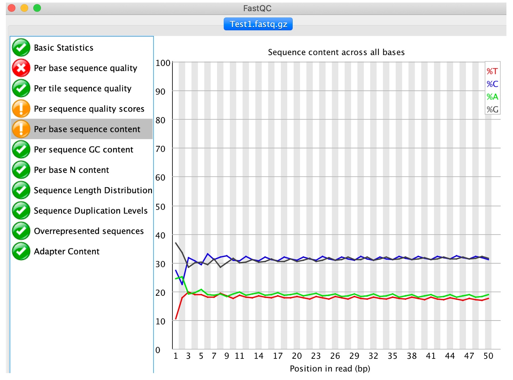

This analysis plots out the proportion of each base position in a file for which each of the four normal DNA base has been called. Note that genomes aren't typically comprised of 25% of each base and therefore the ideal situation would be 4 flat lines with reasonable percentages. Any deviation from a straight line indicates that particular positions within reads have an overrepresentation of particular bases, which would not be expected where the reads will be taken from random places within the genome.  This module issues a warning if the difference between A and T, or G and C is greater than 10% in any position, and a failure if over 20%.

 

#### 7. Click on 'Per base N content'

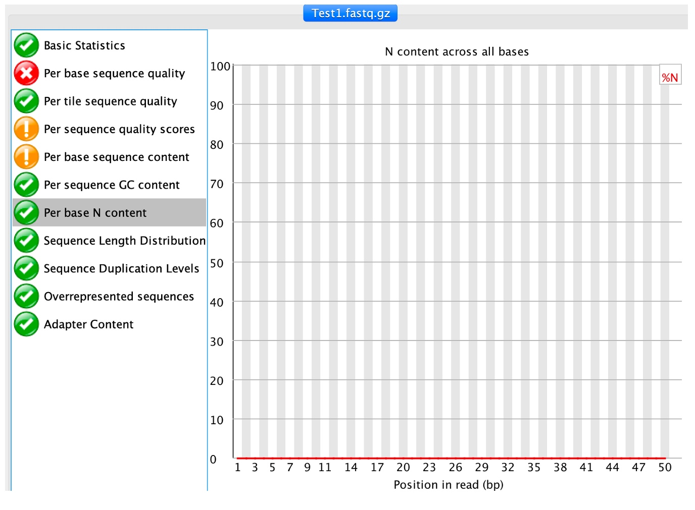

This module outputs the percentage of N base calls at each position. N is usually called when the sequencer is not confident enough to call a conventional base (A, T, C or G). 

 
 

#### 8. Click on 'Sequence length distribution'

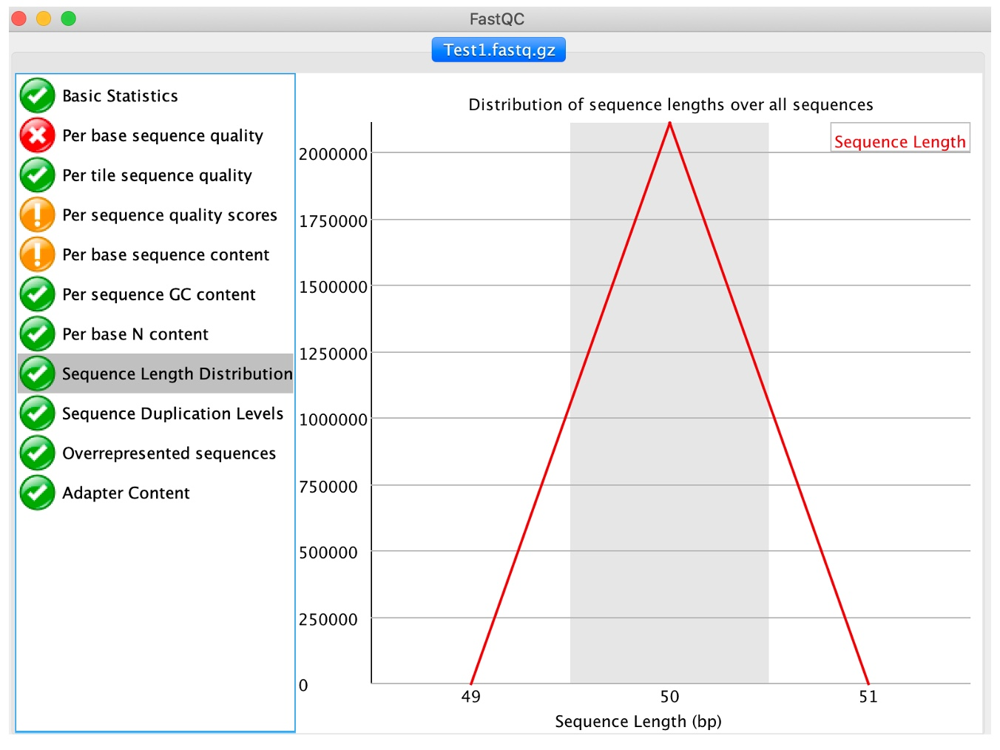

Sequencer produce reads of uniform length. Nevertheless, if reads are trimmed or post-processed due to quality issues we will observe variable read lengths, which may not necessarily affect mapping, as long as reads are still a reasonable length (e.g. 40-50bp or more).

  

#### 9. Click on 'Sequence duplication levels'

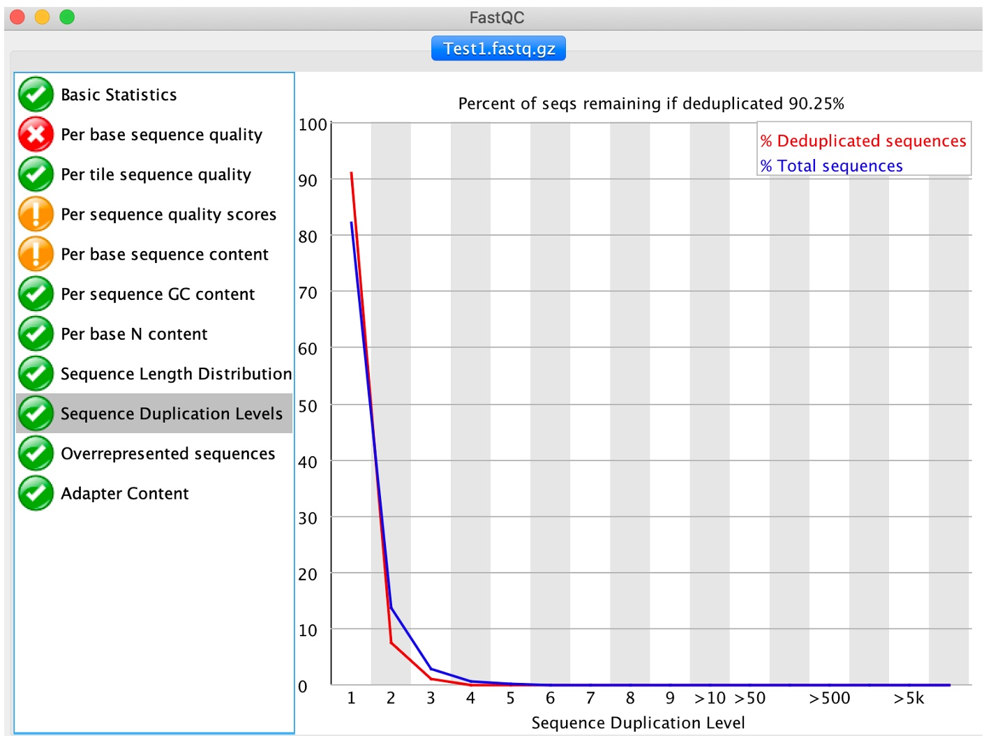

This module computes the degree of duplication of every read in the file by looking for exact matches over the whole length of the rest of reads. A dataset with high depth of coverage, namely an over-represented target genome, will report higher duplication levels than one would expect since multiple reads starting at the same position will be found by chance. Again, this may not be a problem and a threshold can be set at the mapping stag to account for any regions with high read duplication levels.

  

#### 10. Click on 'Overrepresented sequences'

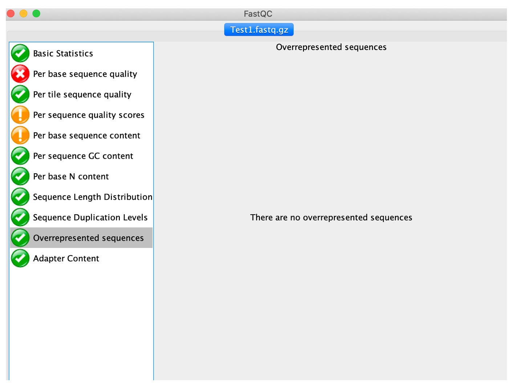

In a normal library, every individual sequence will make up a tiny fraction of the whole set. Therefore, overrepresented reads may be indicators of biologically significant sequences (i.e. gene duplication) or contaminants. All reads representing more than 0.1% of the total amount will be listed. Primers and adaptors are the most common sources of contamination.

 
 

We can keep a record of the FASTQC results. To create a report simply select File > Save Report from the main menu. This will create a folder containing the images from the analyses, an HTML version of module results and text files containing results numeric data. FASTQC can also be run on the command line. For details on running through the commmand line, click [here](https://manpages.ubuntu.com/manpages/trusty/man1/fastqc.1.html).

We have used the FastQC tool to identify problems in raw sequence data. Nevertheless, bad quality issues does not mean that the data are no good; different issues affect the downstream analysis differently and all data can still be used if we applied the right filtering before processing. For example, de novo assembly may be more difficult with poor quality reads, or where there is a lot of contamination.

If we identify some issues with the sequence data, we can then attempt steps to clean the data.

### Extended exercise: 
#### Check the quality of the other sequences using FASTQC (Test2, Test3_1, Test3_2, Test4_1, Test4_3), what potential issues can yoy find in these data?

 

Next acitvity: [Cleaning and filtering FASTQ files](cleaning_fastq.md)
