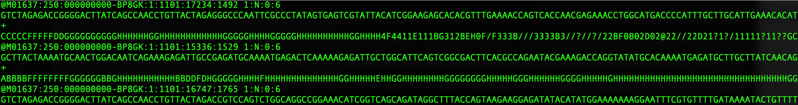
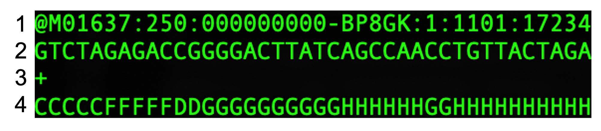

# Viewing raw sequencing data and understanding the FASTQ format


We will first open a FASTQ file so you can see how the raw data looks, though you would not be expected to do any manual QC on the sequence data just by viewing it as these files can contain millions of reads.

We can view the FASTQ file in two ways, either through a text viewer or with the command-line in your terminal. If files are in the zipped format (*.fastq.gz) they will need to be unzipped first to view in this format.

Either:
- Open the “Test4_R1.fastq” file in your “Data” folder in your extended text viewer.

- View the “Test4_R1.fastq” in the command line by entering the following command (note, make sure current working directory is the same folder as the file):


```bash
head -10 Test4_1.fastq
```

The “head’ command will output the first N lines of the file, where N is specified by -N (in our case we have asked for the first 10 lines).

<br>

The output should look like this:




If we look more closely at the file, you will see that it comprised of groups of 4 lines of text for each sequenced read: 



These 4 lines consist of the following information:

1. A sequence identifier with information about the sequencing run and the cluster. The exact contents of this line vary by based on the BCL to FASTQ conversion software used. If the sequence data are paired, there will be a \1 or \2 at the end of this line to denote the forward or reverse read (all reads included will have a forward and reverse entry, called a ‘mate pair’)

2. The sequence (the base calls; A, C, T, G, and N if base cannot be confidently called).

3. A separator (+) between the sequence and quality line.

4. The base call quality scores. These are Phred +33 encoded, using ASCII characters to represent the numerical quality scores. Further information can be found here: https://help.basespace.illumina.com/files-used-by-basespace/quality-scores

<br>
The next step is to assess the quality of these raw sequences and perform additional steps to resolve any potential issues.


<br> **Next activity:** [Quality control (QC) of FASTQ files](Quality_control.md)

