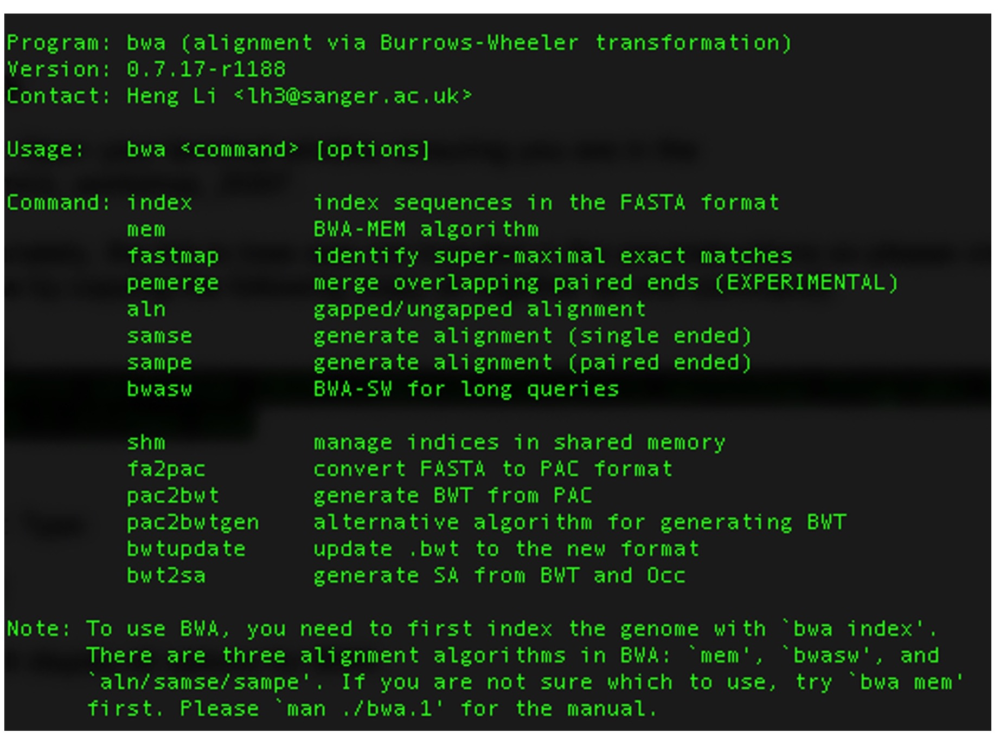
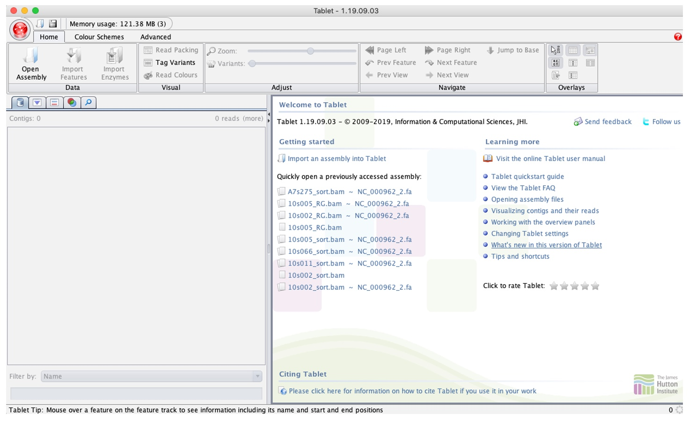
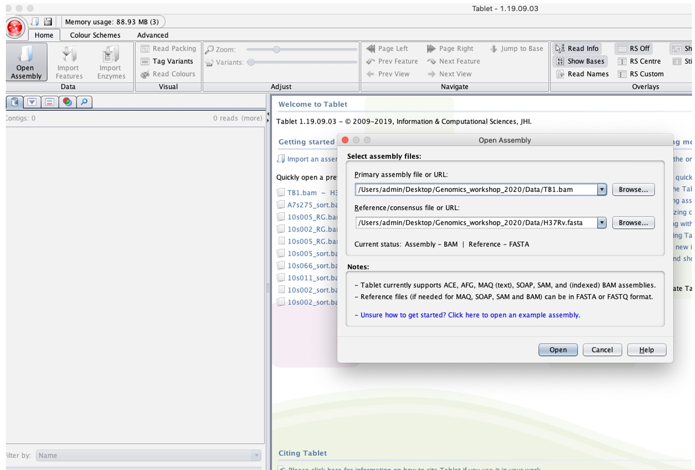

# Mapping/aligning sequence data to a reference genome

After inspecting and potentially improving the quality of the raw sequence FASTQ files, we now want to attempt to reconstruct the genome from the short reads. This process involves aligning the reads against a reference sequence, identifying similarities and differences, and ultimately generating a consensus sequence.

Here, we will go through an approach to do this using [BWA](https://bio-bwa.sourceforge.net). This is a specialized software for mapping sequences against a reference, which is particularly good for low-divergence organisms such as TB. 

For this activity, we will use the following files found in your /data/ folder:

- **TB1_R1.fastq.gz** and **TB1_R2.fastq.gz** – Paired-end 250bp sequence data from _Mycobacterium tuberculosis_, collected from sputum and cultured before DNA library preparation. These have been inspected and cleaned already.

- **H37Rv.fasta** – A single consensus sequence for a laboratory strain of _Mycobacterium tuberculosis_ that has been widely used in tuberculosis research as a well-characterized reference strain. This sequence is 4,411,532 base pairs long and represents the full genome of this sample.

<br>

1. First we can view the options in BWA by simply typing the following command in your terminal:

```bash
  bwa
```

This will display all options for BWA:



<br>

2. Before mapping the reads, we need to first index our reference genome using the BWA ‘index’ command:

```bash
bwa index H37Rv.fasta
```

This will create five new index files associated with the H37Rv.fasta file. To view these, you can enter:

```bash
ls H37Rv*
```

<br>

3. We can now align our paired-end reads for each sample to the reference. As you can see from the options shown in step 1, there are multiple options in BWA for alignment, with the main alignment algorithms being:

- aln/samse/sampe for BWA-backtrack (best for reads under 100bp)
- bwasw for BWA-SW (better for reads over 100bp)
- mem for BWA-MEM (best for reads over 100bp, faster and more accurate than bwasw)

We will just be using the standard parameters for our alignments so will not add any other options but it is important to review and optimize these options for your data. Further information on these options can be found [here].(https://bio-bwa.sourceforge.net/bwa.shtml)

The following command will align our paired reads to the H37Rv reference strain:

```bash
bwa mem H37Rv.fasta TB1_R1.fastq.gz TB1_R2.fastq.gz > TB1.sam
```

This will produce a SAM file in the same folder, which we are calling TB1.sam. 


<br>

4. We now need to convert the SAM file into its binary format – BAM file. This is the format that is required as an input for variant calling software (to be covered in tomorrow's activities) and visualization tools, as well as reducing the file size. We can use SAMtools ‘view’ to convert from SAM to BAM (the -b option tells the program to output a BAM file):

```bash
samtools view -b TB1.sam > TB1.bam
```

_Tip: You can now remove the SAM file now to free up space as we now have the alignment in BAM format:_

```bash
rm TB1.sam 
```

<br>

5. BAM files must be sorted and indexed by the chromosomes/contigs/scaffolds in your reference genome in order to efficiently display/access the data in the BAM file. We can do this with SAMtools:

```bash
samtools sort TB1.bam > TB1_sorted.bam 
```

_Tip: You can rename the sorted BAM file (which will also remove the unsorted BAM file):_

```bash
mv TB1_sorted.bam TB1.bam
```

Then we will index the sorted BAM file that will create an additional .bai file:

```bash
samtools index TB1.bam 
```

<br>

6. Finally, you can print summary statistics from the indexed BAM file using the SAMtools ‘flagstat’ option:

```bash
samtools flagstat TB1.bam 
```

It will look something like this:


Where each line specifies: 
 
| Metric                                         | Description                                                                                                  |
|------------------------------------------------|--------------------------------------------------------------------------------------------------------------|
| 1. Total number of reads                       | Total count of reads in the sequencing dataset.                                                             |
| 2. Duplicates                                  | Number of duplicate reads in the dataset.                                                                    |
| 3. Number of mapped reads                       | Count of reads that successfully align to a reference genome.                                                |
| 4. Paired reads in sequencing                  | Total number of paired-end reads in the sequencing dataset.                                                  |
| 5. Number of forward reads                     | Count of reads aligned in the forward orientation.                                                          |
| 6. Number of reverse reads                     | Count of reads aligned in the reverse orientation.                                                          |
| 7. Number of properly mapped reads             | Reads that are properly mapped, i.e., same chromosome, opposite orientation, and within a few deviations from the expected insert size. |
| 8. Number of reads mapped along with their mates | Total number of reads where both ends of the paired reads are successfully mapped. (7 is a subset of 8)  |
| 9. Singletons                                  | Number of reads mapped alone, i.e., mates not mapped. (8 + 9 = 3)                                            |
| 10. Reads whose mates are mapped to a different chromosome | Reads where one end is mapped to a different chromosome than its mate.                                  |
| 11. Reads whose mates are mapped to a different chromosome with mapping quality greater than 5 | Subset of (10) with a higher mapping quality threshold.                                       |

<br>

_Question: Why might line 3, number of mapped reads, be low? How might you increase the number of mapped reads?_

<br>

Your “TB1 sequence data is now aligned to the reference genome H37Rv and stored in a BAM file, which has been indexed and sorted to the reference.

<br>

### Visualizing BAM files

1. Open the Program “Tablet” that will have saved to the applications on your computer. The opening screen should look like this:



<br>

2. Click the “Open Assembly” button (in red above) to load alignment (TB1.bam) and reference file (H37Rv.fasta) by navigating to the folder these are stored in after clicking 'browse' in the “Select assembly files”.

_Note the BAM file will be the ‘primary assembly’ and H37Rv as the ‘Reference/Consensus’._



<br>


3. This should have loaded the alignment file. Click the space under the “Contigs” section (highlighted in red below):


<br>

Tablet loads and can display up to 25,000bp at a time as default, delimited by the Overview window.

The reference sequence (and amino acid product) is displayed at [1]. The aligned reads are at [2], where each row is an aligned read. You can hover your curser over a read to display information about that read, including the number of mismatches against the reference strain.

To navigate through the genome, you will need to use the bar on top by dragging it (3). To navigate through the 25 Kb loaded you can click and drag the Read panel (2) or use the button below (4). Note that the red numbers in each corner of the Read panel will display the region currently being shown (5).

**Exercise:** 

Scroll to base 1977, what do you see? What feature do you think this might be?

_Hint. It may become clearer if you click the “Tag variants” button in the top panel._

- Zooming into the sequence can be done using the Zoom button in the Top bar.

- You can also jump straight to a base without scrolling by clicking the “jump to Base” button, entering a base coordinate and pressing “Padded Jump”.

- It is possible to change the Overview display to show a Coverage plot by using the “Coverage” button under the “Advanced” tab.

**Exercise:** 

Jump to base 1,955,913, what do you see? Why do you think this is the case? What feature do you think this might be?

Compare this to the sequence at 1,986,639. What do you think the difference is between these regions?


---

### This is the end of the activities in practical session 1. Navigate back to the homepage for other activities [here](../README.md).

