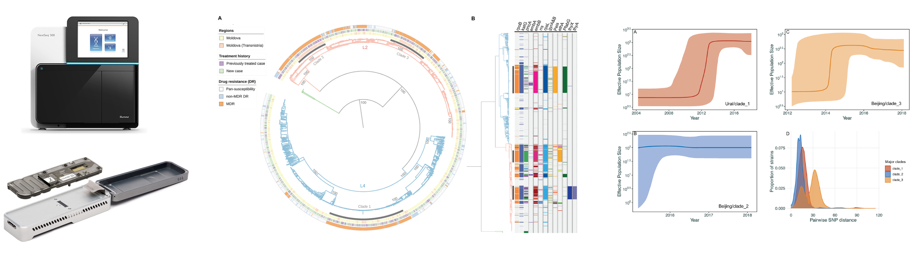

# Genomic Analysis and Phylodynamics Workshop

## 5th - 9th February 2024, Simon Fraser University

### View on [GitHub](https://github.com/bensobkowiak/GenomicsCourse/)

---

Please register your interest in the course [here](https://form.jotform.com/240141804355347) before the 26th January 2024

---

### Pre-workshop instructions

Please click the link below for instructions to download and install all data and software required for this course:

[Pre-course instructions](PreCourse_instructions.md)

---

### Schedule

| Time and Date                  | Topic                                           | Itinerary                                                 |
|--------------------------------|-------------------------------------------------|-----------------------------------------------------------|
| Monday 5th February   10am – 11.30pm | [Lecture 1: Introduction and key concepts](Lectures/Lecture1_WGS.pdf) | • Course outline • Genomic sequencing and data analysis • Introduction to genomic epidemiology |
| Monday 5th February   12:15pm – 4:30pm | [Practical session 1: Whole genome sequence data analysis](Practicals/WGS_Analysis.md) | • Obtaining sequencing data • Raw sequencing data manipulation – Quality control, cleaning, and visualization • Reference-based mapping |
| Tuesday 6th February   10am – 11am | [Lecture 2: Variant detection and phylogenetic trees](Lectures/Lecture2_Variants.pdf) | • What is a variant? • How do we call variants? • Variant calling software and quality control • What are phylogenetic trees? • Different types of phylogenies • Phylogenetic uncertainty – bootstrapping etc. |
| Tuesday 6th February   11:15am – 4:30pm | [Practical session 2: Variant calling and maximum likelihood trees](Practicals/VariantCalling_MLtrees.md) | • Variant calling from sequence alignment file • SNP filtering and QC • Building SNP matrices • Aligning consensus sequences • Maximum likelihood tree construction |
| Wednesday 7th February   10am – 1pm | [Practical session 3: Timed phylogenetic trees](Practicals/Phylogenetics.md) | • Continue ML tree construction • One-step timed phylogenetic tree with BEAST2 • Two-step timed phylogenies using ML + Bayesian frameworks |
| Friday 9th February   10am – 11am | [Lecture 3: Phylogeography and phylodynamics](Lectures/Phylogeography_Phylodynamics.md) | • What are phylogeography and phylodynamics? • Analysis tools and software • Applications to real-world datasets – what can we learn |
| Friday 9th February   11.15am – 4:30pm | [Practical session 4: Phylogeography and phylodynamic analysis](Practicals/Phylodynamics.md) | • Phylodynamic analysis in BEAST2 • Testing for sites under selection  • Ancestral state reconstruction   • Genome Wide Association Studies |
| Take home activity  | [Practical session 5: Self-guided practical](Practicals/Full_pipeline_test.md) | • Applying the skills learned to a novel dataset • From raw sequence data to phylogenetic and phylodynamic analysis |

Author: Ben Sobkowiak [Email](mailto:b.sobkowiak.12@ucl.ac.uk)
